<div align="center">
  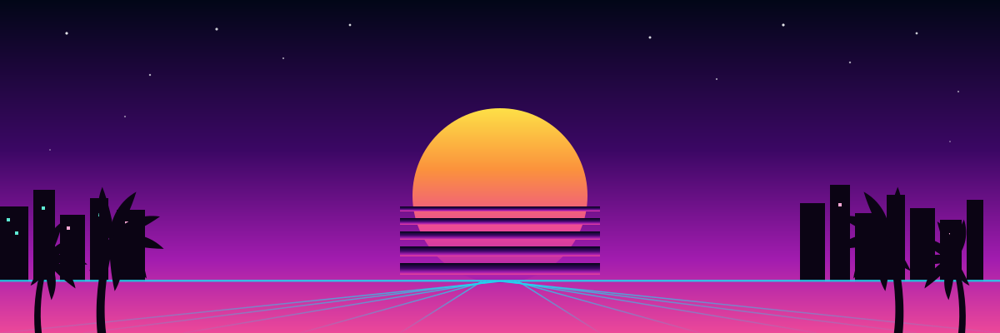

  <h1>🌴 Vice City Postcards 🏎️</h1>

  <p><strong>Build Your GTA-Inspired Adventure with the Unlayer React Image Editor</strong></p>

  <p>
    An immersive, AAA-inspired web experience where you explore iconic fictional locations and design
    custom neon-drenched postcards using a deeply integrated <code>@unlayer/react-image-editor</code> studio.
  </p>

  <p>
    <a href="https://voice-city-postcards.vercel.app"><strong>▶ Live Demo</strong></a> •
    <a href="#-features">Features</a> •
    <a href="#-tech-stack">Tech Stack</a> •
    <a href="#-architecture">Architecture</a> •
    <a href="#-installation--setup">Installation</a> •
    <a href="#-usage">Usage</a>
  </p>
</div>

---

## 🏆 Project Overview

**Vice City Postcards** turns a standard image-editor SDK into a cohesive, gamified creative studio. Instead of a
generic "upload an image" flow, you embark on an adventure: pick a retro location, write a message, and step into
**Vice Studio**, where the Unlayer React Image Editor drives filters, stickers, drawing and text on a postcard that
already has your message composed onto it — then stamp it with a Vice City badge, export it, and watch it land in
your gallery with a badge unlock.

The app is fully playable with zero setup at **[voice-city-postcards.vercel.app](https://voice-city-postcards.vercel.app)** — no sign-up, no server round-trip, everything runs in your browser.

## ✨ Features

- **🎮 Immersive Location Explorer** — six GTA-inspired locations (beach, marina, neon district, islands, downtown), searchable and filterable, with Framer Motion animations and a neon glassmorphism UI.
- **📝 Postcard Generator** — pick a theme (Sunset, Neon, Retro, Luxury, Tropical), write a title and message, and preview the postcard live before it ever touches the editor.
- **🎨 Full Postcard Studio** — a tightly integrated `@unlayer/react-image-editor` environment with native filters, crop, resize, draw, shapes, text and stickers. Your title and message are composed onto the photo automatically before the editor opens, styled to match your theme, and stay fully editable with the editor's own Text tool. Point it at an Unlayer project with the AI entitlement and the built-in AI Assistant lights up too.
- **🏅 Vice City Badge Pack** — five custom-designed badges (postmark stamp, neon sign, beach seal, tourist pass, luxury seal) you stamp directly onto the canvas, in any corner, with one click and one-click undo.
- **💾 Quota-Safe Local Persistence** — drafts and exported postcards are compressed before they touch `localStorage`, so the gallery keeps growing instead of silently failing when the browser's storage fills up.
- **🖼️ A Gallery That's Never Empty** — five professionally designed sample postcards greet first-time visitors; they disappear the moment you save your own.
- **🏅 Achievement System** — gamified badges like "First Adventure", "Postcard Master" and "Beach Lover" unlock as your collection grows, with a celebration on the success page.
- **📤 Share-Ready Export** — a real PNG (not a placeholder), download / open-gallery / create-another actions, and one-click share links to X, LinkedIn and Facebook.
- **♿ Accessible by Design** — every icon-only control has an accessible name, the location modal is a real focus-trapped dialog, contrast passes WCAG AA, and `prefers-reduced-motion` is honoured everywhere. Verified with `axe-core`: **0 violations across 9 screens**.
- **⚡ Fast & Responsive** — self-hosted images, code-split landing sections, a CSS-only hero entrance, and layouts that hold up from a 4K desktop down to a 390px phone with zero horizontal overflow.

---

## 📸 Screenshots

| Landing — Hero | Landing — "Create Your Vice City Story" |
| :---: | :---: |
| 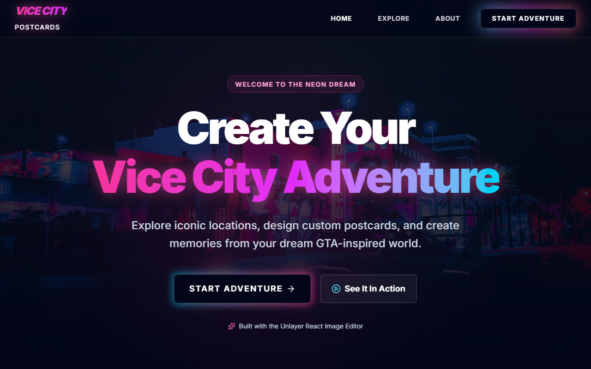 | 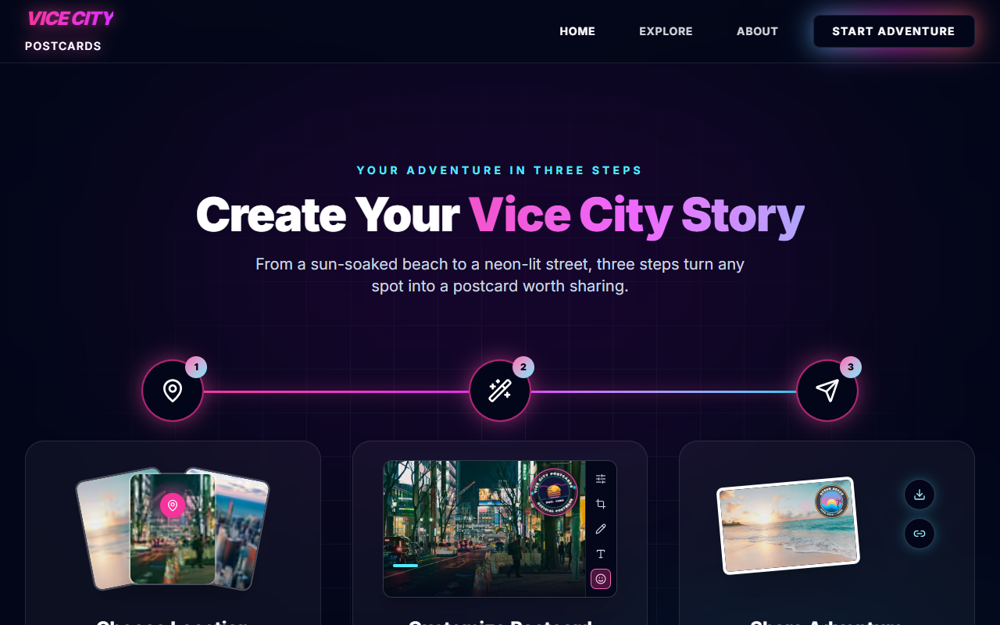 |

| Explore Locations | Postcard Generator |
| :---: | :---: |
| 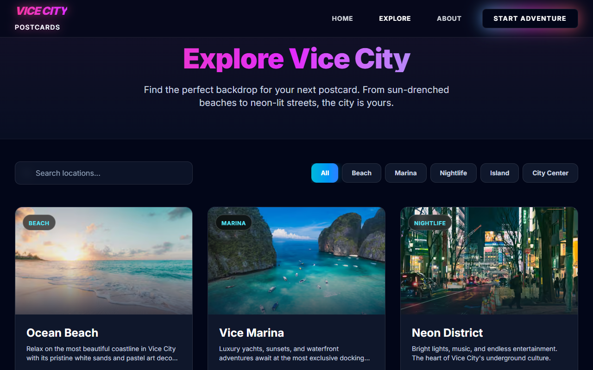 | 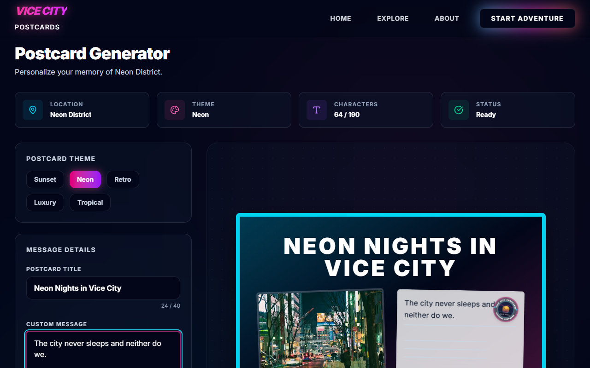 |

| Vice Studio Editor (with Badge Pack) | Export Success |
| :---: | :---: |
| 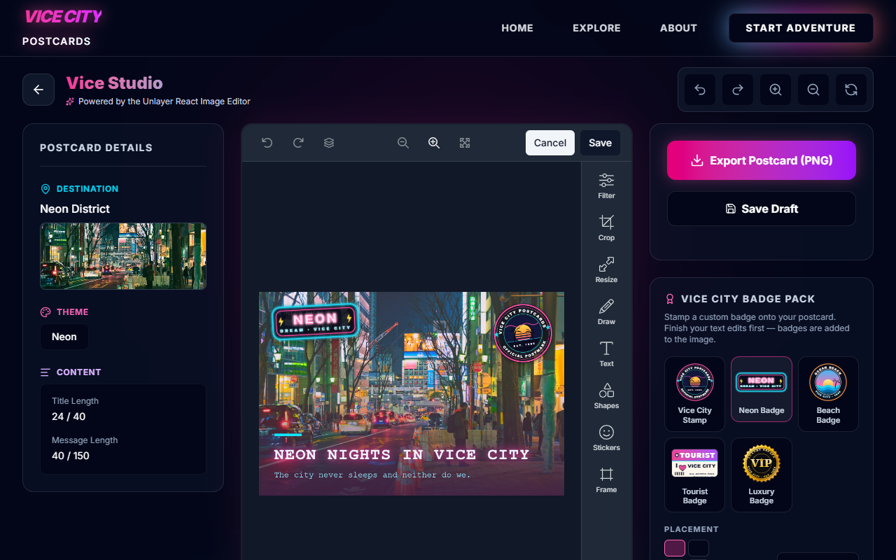 | 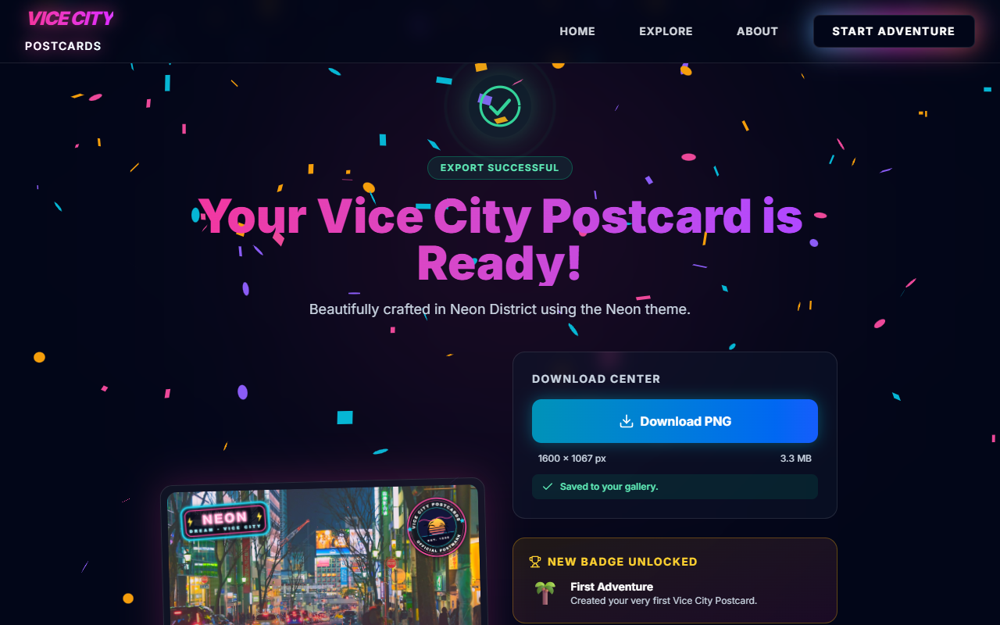 |

| Gallery (with a saved postcard) | Gallery (first visit — sample postcards) |
| :---: | :---: |
| 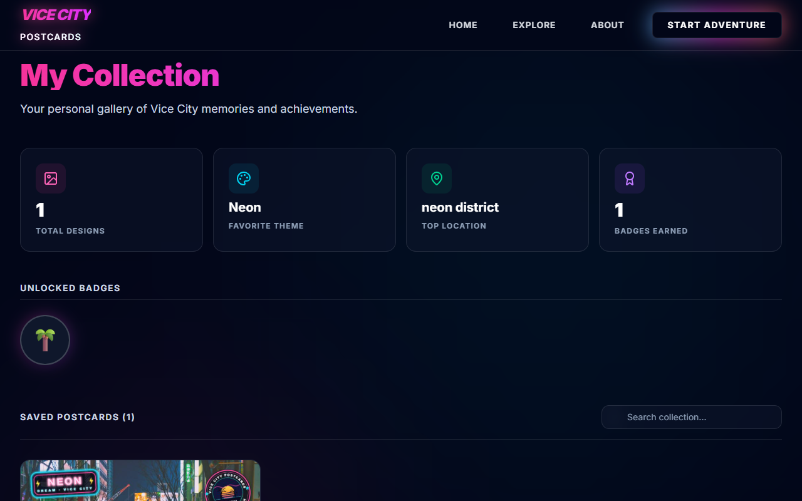 | 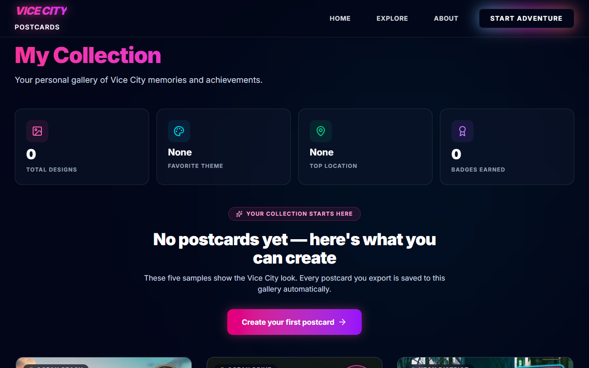 |

<p align="center">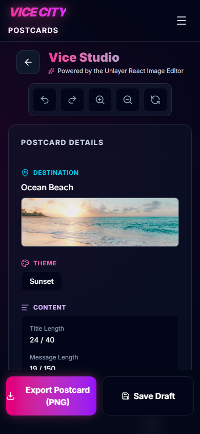</p>

## 🎬 Demo

<p align="center">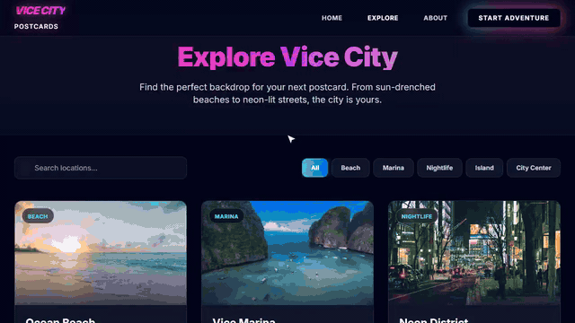</p>

A full walkthrough — location selection → editor → filters/stickers/badges → export → gallery — also autoplays on
the landing page's **"See It In Action"** section, with clickable chapters. The clip above is the same recording of
the live app, not a mock-up.

---

## 🛠 Tech Stack

**Frontend**
- **Framework:** Next.js 16 (App Router, React 19)
- **Language:** TypeScript (strict mode, zero `any`)
- **Styling:** Tailwind CSS 4
- **Animations:** Framer Motion, CSS keyframes for above-the-fold entrances, React Confetti
- **State:** Zustand (in-memory for the in-progress postcard, `persist` + a quota-safe storage adapter for the saved collection)
- **Editor SDK:** `@unlayer/react-image-editor`

**Backend** *(optional — see [Architecture](#-architecture))*
- Node.js, Express 5, TypeScript
- Helmet, CORS allowlist, rate limiting, `trust proxy`-aware for deployment behind Render/Railway/etc.

**Quality**
- ESLint (0 errors) · `npm audit` (0 known vulnerabilities in either package) · Lighthouse Accessibility **100**, Best Practices **100**, SEO **100** · `axe-core` **0 violations** across 9 screens · end-to-end verified with an automated Playwright script covering the full flow on desktop, tablet and phone.

---

## 🏗 Architecture

The frontend follows a feature-based structure (`src/features/*`); the backend is a separate, currently-optional
Express service (see the note below the diagram).

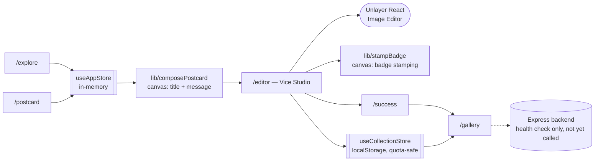

- `src/features/landing` — Hero, the "Create Your Vice City Story" section, the "See It In Action" demo player, feature showcase and gallery preview.
- `src/features/locations` — the location explorer and the accessible location modal.
- `src/features/postcard` — the theme/message form and live postcard preview.
- `src/features/editor` — the Unlayer wrapper, header toolbar (proxies the editor's own Undo/Redo/Zoom), the Badge Pack, Studio Guide and export panel.
- `src/features/achievements` / `src/features/stats` — badge-unlock logic and collection statistics.
- `src/features/gallery` — the saved-postcard grid and the sample-postcard fallback.
- `src/lib` — `composePostcard.ts` (canvas text compositing) and `stampBadge.ts` (canvas badge stamping): the two pieces that make the editor's promises real without depending on a paid Unlayer plan.
- `backend/` — an Express + TypeScript service with security middleware already wired up (Helmet, CORS, rate limiting). It isn't called by the frontend yet; it exists as the starting point for the cloud-sync feature described under [Future Scope](#-future-scope).

---

## 🚀 Installation & Setup

**Requirements:** Node.js ≥ 20.9 and npm.

1. **Clone the repository**
   ```bash
   git clone https://github.com/jagga-123/Voice-city-postcards.git
   cd Voice-city-postcards/frontend
   ```

2. **Install dependencies**
   ```bash
   npm install
   ```

3. **Set up environment variables**
   ```bash
   cp .env.example .env.local
   ```
   Both variables are optional — the app works out of the box. See `.env.example` for what each one does
   (a real Unlayer project ID to unlock the AI Assistant; the site's public URL for social-share previews).

4. **Start the development server**
   ```bash
   npm run dev
   ```

5. Open [http://localhost:3000](http://localhost:3000).

### Optional: run the backend

The Express backend isn't required for the app to work, but if you want to run it:

```bash
cd ../backend
npm install
cp .env.example .env
npm run dev      # serves GET /api/v1/health on http://localhost:5000
```

### Deploying

- **Frontend (Vercel):** import the repo, set **Root Directory** to `frontend`. No environment variables are required; set `NEXT_PUBLIC_SITE_URL` only if you're using a custom domain.
- **Backend (Render/Railway/etc.):** Root Directory `backend`, build command `npm install && npm run build`, start command `npm start`. Set `CORS_ORIGIN` to your deployed frontend's URL.

---

## 🕹 Usage

1. **Explore** — search or filter locations, then open one to see its highlights.
2. **Create Postcard** — pick a theme, write a title and message; the live preview updates as you type.
3. **Customize with Image Editor** — Vice Studio opens with your text already placed on the photo. Use the native
   tools (Filter, Crop, Resize, Draw, Text, Shapes, Stickers, Frame) and the **Vice City Badge Pack** in the sidebar
   to stamp a badge onto a corner. Save Draft at any point — it's restored the next time you open this location.
4. **Export Postcard (PNG)** — lands on a success screen with your download, a badge unlock if you earned one,
   share links, and one-click paths to the gallery or a brand-new postcard.
5. **Gallery** — every export is saved here (compressed, so the collection doesn't run into browser storage
   limits), alongside your unlocked achievement badges.

---

## 🎯 Challenge Compliance

- ✅ **Original Concept** — a narrative-driven adventure, not a generic photo-upload utility.
- ✅ **React Image Editor Integration** — Unlayer's SDK is the core of Vice Studio: native tools, a canvas-composed
  starting image, and badge stamping all build on its public `getImage()` / `reset()` API without touching its
  internals.
- ✅ **Visual Customization** — filters, text, stickers, shapes, drawing, cropping and five custom badges.
- ✅ **Polish & Accessibility** — Lighthouse Accessibility 100, `axe-core` 0 violations, keyboard-navigable dialogs,
  visible focus states, honoured reduced-motion.
- ✅ **Open Source** — MIT licensed.

## 🔭 Future Scope

- **Cloud Synchronization** — wire the existing Express backend to a database (e.g. Postgres via Prisma) so a
  collection can follow a user across devices instead of living only in `localStorage`.
- **Shareable Public Links** — a real per-postcard URL (the `SharePanel`'s `postcardId` prop already anticipates this).
- **Custom Sticker API** — expand the Badge Pack into a full custom-asset pipeline once a paid Unlayer plan is available.
- **Multiplayer Collaboration** — co-edit a postcard in real time.

---

<div align="center">
  <p><i>Welcome to Vice City. Your adventure awaits.</i></p>
</div>
